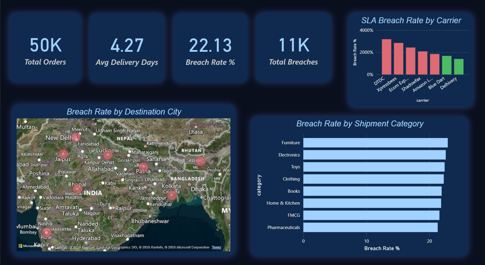
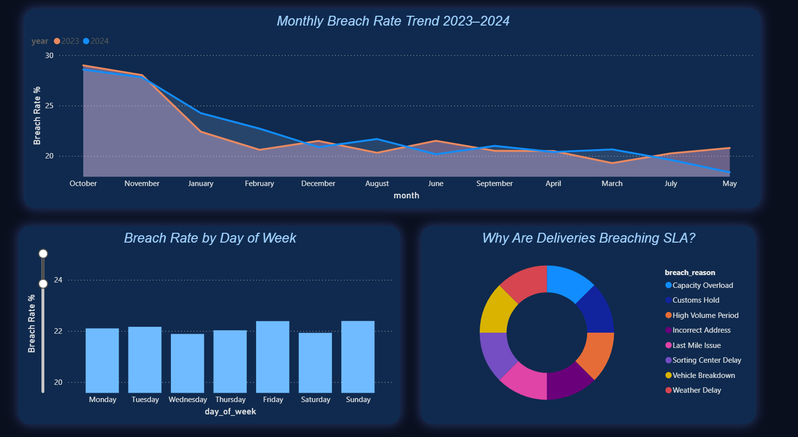
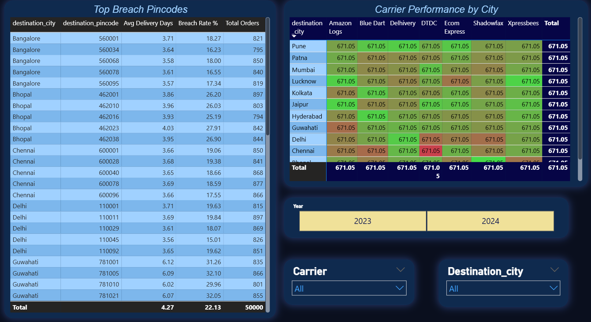

# 🚚 India Supply Chain Optimization Dashboard

## 📌 Problem Statement
A logistics company faces a **22.1% SLA breach rate** — 
1 in 5 deliveries is arriving late. This project identifies 
the root causes across carriers, cities, pincodes, and time 
periods using SQL analysis and an interactive Power BI dashboard.

---

## 🛠️ Tools & Technologies
- **Python** — Synthetic data generation, EDA, visualization
- **MySQL** — SLA breach analysis by carrier, pincode, day of week
- **Power BI** — 3-page interactive dashboard with drill-down
- **GitHub** — Version control, documentation

---

## 📊 Dashboard Preview

### Page 1 — Executive Overview

### Page 2 — Time & Operations Trends

### Page 3 — Drill Down Analysis

---

## 🔍 Key Findings

| Metric | Value |
|---|---|
| Overall Breach Rate | 22.1% |
| Worst Carrier | DTDC (31.9%) |
| Best Carrier | Delhivery (14.1%) |
| Worst City | Guwahati (31.6%) |
| Best City | Mumbai (16.5%) |
| Festive Season Spike | ~40% increase in Oct/Nov |
| Top Breach Reason | Capacity Overload |

---

## 📁 Project Structure
